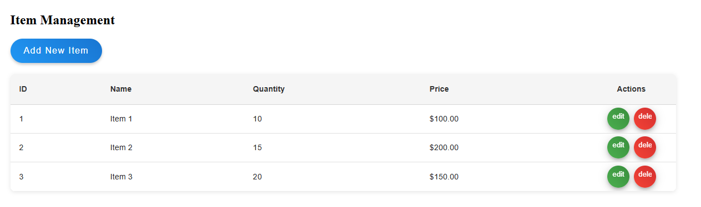
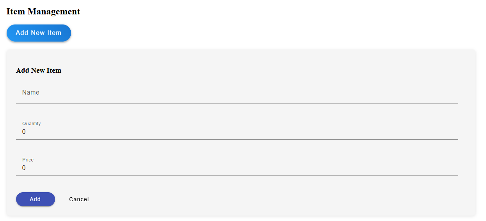
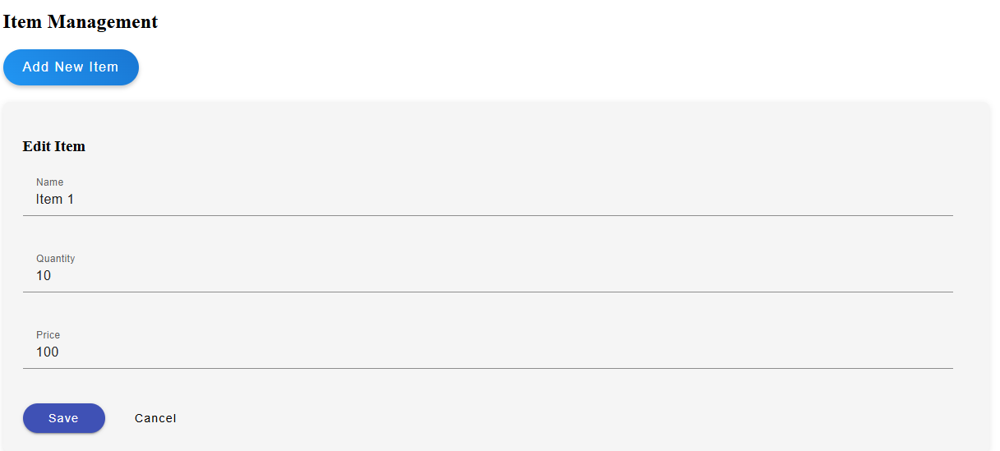
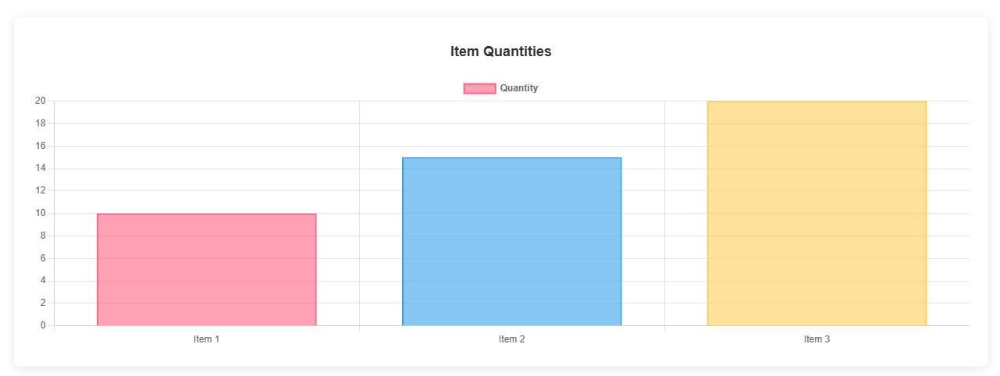

# Angular CRUD Table with Chart Visualization

A modern Angular application featuring a CRUD (Create, Read, Update, Delete) table with chart visualization using Angular Material and Chart.js.

## Screenshots

### Main Table View


### Add Item Form


### Edit Item Form


### Chart Visualization


## Features

- CRUD operations for managing items
- Material Design table with sorting and filtering
- Interactive bar chart visualization using Chart.js
- Modern UI with animations and tooltips
- Responsive design

## Technologies Used

- Angular 17
- Angular Material
- Chart.js / ng2-charts
- TypeScript
- SCSS

## Getting Started

1. Clone the repository:
```bash
git clone https://github.com/tejasvende9/Angular-CRUD-Table-with-Chart-Visualization-.git
```

2. Install dependencies:
```bash
npm install
```

3. Run the development server:
```bash
ng serve
```

4. Open your browser and navigate to `http://localhost:4200`

## Features

### Table Features
- Add new items
- Edit existing items
- Delete items
- Responsive design
- Material Design styling

### Chart Features
- Dynamic bar chart visualization
- Auto-updating on data changes
- Custom color scheme
- Interactive tooltips

## Contributing

Feel free to submit issues and enhancement requests!
